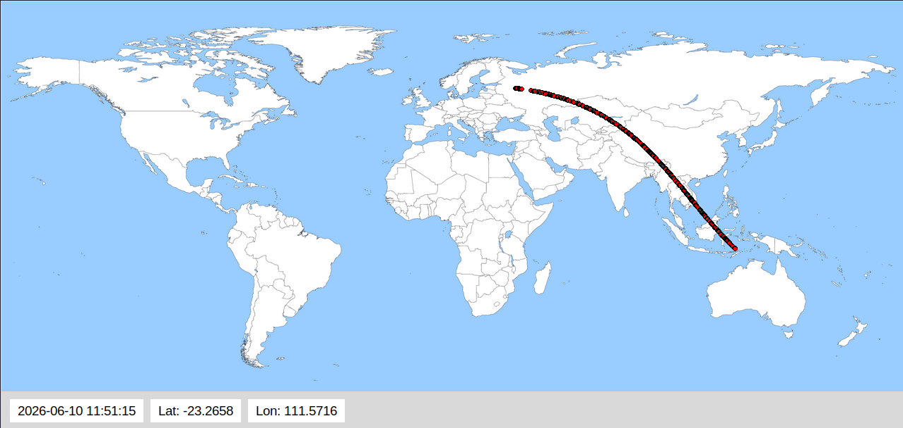

# iss-tracker

Python GUI application that tracks the **International Space Station (ISS)** in real time and displays its position on a world map.

---

## Features

- Live tracking of the ISS using a public API  
- Displays real-time latitude, longitude, and UTC timestamp   
- Automatically updates every 2 seconds (roughly)  
- Lightweight GUI built with Tkinter
- Draws a trailing line
  
## Installation / Getting Started

### Option 1: Using Git (recommended)
If you have Git installed, run the following in your terminal:

```bash
git clone https://github.com/d-tuzzy/iss-tracker.git
cd iss-tracker
```

### Option 2: Without Git 
1. Click **Code → Download ZIP** on GitHub.  
2. Extract the ZIP to a folder of your choice (for example, `C:\Users\Dan\Downloads\iss-tracker`).  
3. Open a terminal (PowerShell or CMD on Windows, Terminal on macOS/Linux).  
4. Navigate to the folder where you extracted the files using `cd`.

### Running the script
Once you are in the project folder, run:

```bash
python iss-tracker.py
```

## Example Usage


## Notes

- Requires Python 3.6+
- Requires tkinter, PIL, requests, and datetime modules
- Works on Windows, macOS, and Linux

## License
MIT License — see [LICENSE](LICENSE).
